# 基于TCP的聊天室

## 0. 功能

### 0.1 客户端

- 用户需要登录，登录时只需要输入一个昵称，程序将判断昵称是否重复。
- 用户登录以后连接服务器端，进入聊天室。
- 用户可以输入聊天信息，也可以收到别人的聊天信息。
- 用户输入`/exit`可以退出聊天室。

### 0.2 服务器端

- 每连接上一个客户端，启动一个新线程。
- 服务器端保存所有客户端，并且在线程中与客户端进行交互：如果有客户端登录、退出、提交聊天，都会发送消息给所有客户端。
- 实现了基于TCP的文本、语音、图片传输。

## 1. 编译

项目已经编写好Makefile文件，生成目标可执行文件。

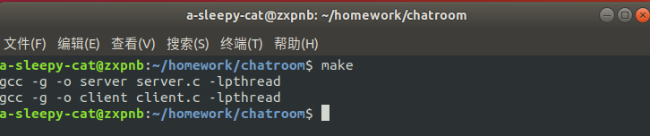

## 2. 客户端启动

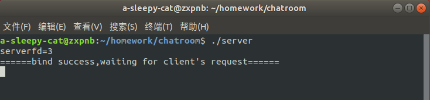

## 3. 客户端连接

下文使用两个客户端进行演示，客户端1的登录名为zxp，客户端2的登录名为wch，实际容量为100人。

### 3.1 客户端1登录


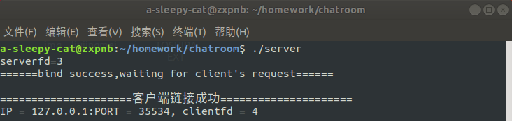

### 3.2 客户端2登录

一开始我们使用zxp为登录名进行登录，服务器端查询到与客户端1重复，提示重新输入登录名。

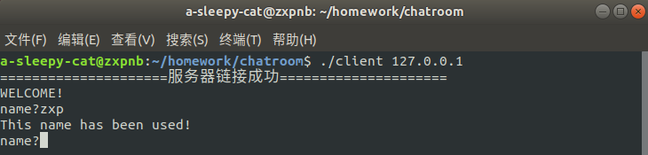

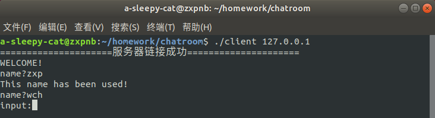

此时客户端1接收到客户端2加入聊天室的提示信息。

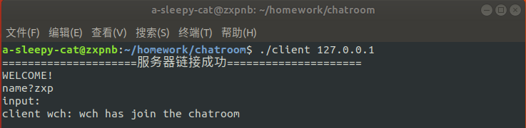

## 4. 客户端之间通信

客户端2发送消息。

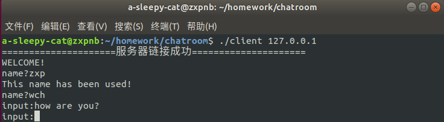

客户端1接受到消息并显示（由服务器转发）

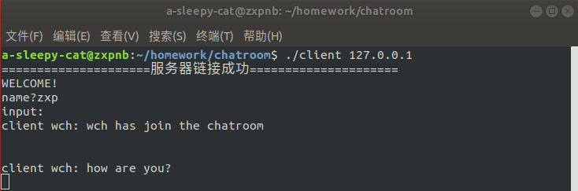

客户端1发送消息。

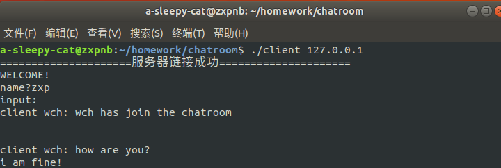

客户端2接收到消息并显示（由服务器转发）

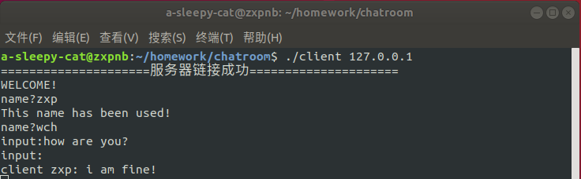

## 5. 基于TCP的各类文件传输

演示主要分为3个部分，图片传输（1.png），文本传输（hello.txt），音频传输（music.m4a）

### 5.1 图片传输

下图中为要传输的文件所在目录和接受文件夹目录的信息。

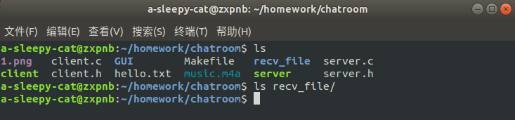

输入`/file`进入文件传输模式，按照提示输入文件名后按回车，文件即可传输。


可以看到服务器端已经接收到了文件，并显示出文件名，文件大小，以及保存路径。


比对发送的文件以及接收到的文件的大小，发现一致。

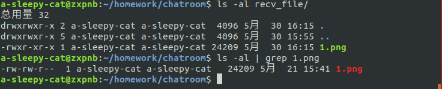

### 5.2 文本传输

输入`/file`进入文件传输模式，按照提示输入文件名后按回车，文件即可传输。


可以看到服务器端已经接收到了文件，并显示出文件名，文件大小，以及保存路径。


比对发送的文件以及接收到的文件的大小，发现一致。

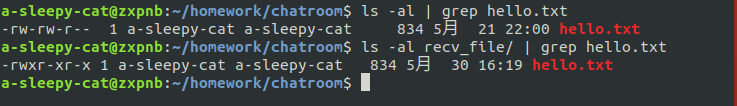

### 5.3 音频传输

输入`/file`进入文件传输模式，按照提示输入文件名后按回车，文件即可传输。


可以看到服务器端已经接收到了文件，并显示出文件名，文件大小，以及保存路径。


比对发送的文件以及接收到的文件的大小，发现一致。


## 6. 客户端退出

输入`/exit`后退出客户端。

客户端2收到客户端1退出聊天室的消息。


## 7. Makefile

```makefile
all:Server Client 
Server:server.c server.h
	gcc -g -o server server.c -lpthread
Client:client.c
	gcc -g -o client client.c -lpthread
clean:
	rm server client

```

