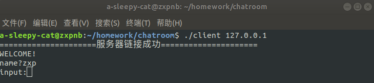
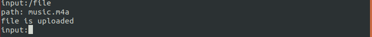
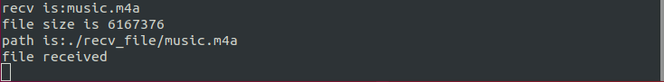

# 基于TCP的聊天室

> 本项目被托管在 <https://git.nju.edu.cn/a-sleepy-cat/chatroom>

## 1. 编译

项目已经编写好Makefile文件，生成目标可执行文件。


## 2. 客户端启动


## 3. 客户端连接

下文使用两个客户端进行演示，客户端1的登录名为zxp，客户端2的登录名为wch，实际容量为100人。

### 3.1 客户端1登录




### 3.2 客户端2登录

一开始我们使用zxp为登录名进行登录，服务器端查询到与客户端1重复，提示重新输入登录名。


此时客户端1接收到客户端2加入聊天室的提示信息。


## 4. 客户端之间通信

客户端2发送消息。


客户端1接受到消息并显示（由服务器转发）


客户端1发送消息。


客户端2接收到消息并显示（由服务器转发）


## 5. 基于TCP的各类文件传输

演示主要分为3个部分，图片传输（1.png），文本传输（hello.txt），音频传输（music.m4a）

### 5.1 图片传输

下图中为要传输的文件所在目录和接受文件夹目录的信息。


输入`/file`进入文件传输模式，按照提示输入文件名后按回车，文件即可传输。


可以看到服务器端已经接收到了文件，并显示出文件名，文件大小，以及保存路径。


比对发送的文件以及接收到的文件的大小，发现一致。


### 5.2 文本传输

输入`/file`进入文件传输模式，按照提示输入文件名后按回车，文件即可传输。


可以看到服务器端已经接收到了文件，并显示出文件名，文件大小，以及保存路径。


比对发送的文件以及接收到的文件的大小，发现一致。


### 5.3 音频传输

输入`/file`进入文件传输模式，按照提示输入文件名后按回车，文件即可传输。



可以看到服务器端已经接收到了文件，并显示出文件名，文件大小，以及保存路径。



比对发送的文件以及接收到的文件的大小，发现一致。


## 6. 客户端退出

输入`/exit`后退出客户端。

客户端2收到客户端1退出聊天室的消息。


## 7. 源码参考

### 7.1 server.h

```c
#include <stdio.h>
#include <stdlib.h>
#include <string.h>
#include <sys/types.h>
#include <sys/socket.h>
#include <sys/stat.h>
#include <errno.h>
#include <signal.h>
#include <fcntl.h>
#include <unistd.h>
#include <netinet/in.h>
#include <arpa/inet.h>
#include <pthread.h>

#define PORT 8888
#define BACKLOG 100
#define MAXDATASIZE  2048

/*聊天室成员信息*/
typedef struct Member{
    char name[100];
    int sockfd;
    struct Member *next;
} Member;

/*聊天室成员链表*/
typedef struct Room{
    Member *head;
    int n;
}Room;

typedef struct File_info{
    int filesize;
    char filename[100];
}File_info;

Member *CreateNode(char name[], int sockfd);
void AddOnlineUsr(Room *room, Member *usr);
void DeleteOnlineUsr(Room *room, Member *usr);
Member *searchbyname(Room *room, char *name);
Member *searchbysockfd(Room *room, int sockfd);
int GetUserInfo(char *name, int client_sockfd);
int StartServer(void);
void *pthread_func(void *fd);
void broadcastmsg(int fd, char recv_buf[]);
void recv_file(int fd);


```

### 7.2 server.c

```c
#include "server.h"
Room room1={ NULL,0 };

/**
  * @brief 创建结点
  * @param name-->姓名，sockfd-->客户端Socket描述符
  * @retval 该客户的成员信息
  * @details None
  */
Member *CreateNode(char name[], int sockfd)
{
    Member *p = (Member *)malloc(sizeof(Member));
    strcpy(p->name,name);
    p->sockfd = sockfd;
    p->next = NULL;
    return p;
}

/**
  * @brief 添加结点
  * @param room-->聊天室链表;  usr-->成员信息结点
  * @retval None
  * @details None
  */
void AddOnlineUsr(Room *room, Member *usr)
{
    Member *p = NULL;
    if(room->n == 0){
        room->head=usr;
    }
    else{
        for(p = room->head; p->next != NULL; p=p->next);
        p->next = usr;
    }
    room->n++;
}

/**
  * @brief 删除结点
  * @param room-->聊天室链表;  usr-->成员信息结点
  * @retval None
  * @details None
  */
void DeleteOnlineUsr(Room *room, Member *usr)
{
    Member *p1 = NULL, *p2 = NULL;
    for(p1 = room->head; p1 != NULL; p1 = p1->next){
        if(p1->sockfd == usr->sockfd)
            break;
        p2 = p1;
    }
    if( p1 == room->head){
        room->head = p1->next;
        free(p1);
    }
    else{
        p2->next = p1->next;
        free(p1);
    }
    room->n--;
}

/**
  * @brief 由姓名查找聊天室成员
  * @param name-->成员姓名指针
  * @retval 搜索到的成员结点
  */
Member *searchbyname(Room *room, char *name)
{
    Member *p = room->head;
    for (;p != NULL; p = p->next)
        if (strcmp(name, p->name) == 0)
            return p;
    return NULL;
}

/**
  * @brief 由sockfd查找聊天室成员
  * @param sorkfd-->成员姓名指针
  * @retval 搜索到的成员结点
  */
 Member *searchbysockfd(Room *room, int sockfd)
{
    Member *p = room->head;
    for (;p != NULL; p = p->next)
        if (p->sockfd == sockfd)
            return p;
    return NULL;
}

/**
  * @brief 与用户交互，获得登录名
  * @param name-->用户登录名 client_sockfd-->文件描述符
  * @retval successful-->1 failed-->0
  * @details 判断登录名是否重复
  */
int GetUserInfo(char *name, int client_sockfd)
{
    char send_buf[MAXDATASIZE]={'\0'};
    strcpy(send_buf, "name?");
    send(client_sockfd, send_buf, sizeof(send_buf), 0);
    recv(client_sockfd, name, MAXDATASIZE, 0);
    if(name[strlen(name)-1] == '\n')
        name[strlen(name)-1] = '\0';
    if (searchbyname(&room1, name))
    {
        strcpy(send_buf, "used");
        send(client_sockfd, send_buf, sizeof(send_buf), 0);
        return 1;
    }
    else
    {
        strcpy(send_buf, "ok");
        send(client_sockfd, send_buf, sizeof(send_buf), 0);
        return 0;
    }
    
}

/**
  * @brief 启动服务器端服务，等待客户端连接
  * @param None
  * @retval successful-->Socket文件描述符;    failed-->-1
  * @details 1. 通配地址 INADDR_ANY 表示IP地址为 0.0.0.0 
  *             内核在套接字被连接后选择一个本地地址。
  *          2. 指派为通配端口 0，
  *             调用 bind 函数后内核将任意选择一个临时端口
  */ 
int StartServer(void)
{

    int serverfd;
    int * clientfd;
    struct sockaddr_in serveraddr,clientaddr;

    //socket()创建一个socket描述符
    //listen()创建一个监听队列，保存用户的请求连接信息（ip、port、protocol)
    //accept()从listen函数维护的监听队列里取一个客户连接请求处理

    serverfd = socket(AF_INET, SOCK_STREAM, 0);
    printf("serverfd=%d\n", serverfd);

    serveraddr.sin_port = htons(PORT); 
    serveraddr.sin_addr.s_addr = htonl(INADDR_ANY);
    bind(serverfd, (struct sockaddr*)&serveraddr, sizeof(serveraddr));
    listen(serverfd, BACKLOG);       
    printf("======bind success,waiting for client's request======\n");
    //让操作系统回填client的连接信息（ip、port、protocol）
    socklen_t client_len = sizeof(clientaddr);
    while(1)
    {
        pthread_t id;
        clientfd = (int *)malloc(sizeof(int));
        *clientfd = accept(serverfd, (struct sockaddr*)&clientaddr, &client_len);
        
        if(*clientfd!=-1){
            printf("\n=====================客户端链接成功=====================\n");
            printf("IP = %s:PORT = %d, clientfd = %d\n", inet_ntoa(clientaddr.sin_addr), ntohs(clientaddr.sin_port), *clientfd);
        }
        else{
            printf("\n=====================客户端连接失败=====================\n");
            continue;
        }
        if(pthread_create(&id, NULL, pthread_func, clientfd)!=0){         //创建子线程 
            perror("pthread_create");
            break;
        }
    }
    shutdown(*clientfd,2);
    shutdown(serverfd,2);
    return 0;
}

/**
  * @brief 客户线程处理函数
  * @param 客户端socket文件描述符
  * @retval None
  * @detail None
  */
void *pthread_func(void *fd){
    int client_sockfd;
    char recv_buf[MAXDATASIZE] = {'\0'}, send_buf[MAXDATASIZE] = {'\0'};
    char name[MAXDATASIZE] = {'\0'}, temp[MAXDATASIZE] = {'\0'};
    Member *usr = NULL;

    client_sockfd=*(int *)fd;
    if (room1.n < 100)
        strcpy(send_buf,"WELCOME!\n");
    else
        strcpy(send_buf, "FULL!\n");
    send(client_sockfd, send_buf, sizeof(send_buf), 0);

    while(GetUserInfo(name, client_sockfd));
    usr = CreateNode(name, client_sockfd);
    AddOnlineUsr(&room1, usr);
    snprintf(temp, MAXDATASIZE, "%s has join the chatroom\n", searchbysockfd(&room1, client_sockfd)->name);
    broadcastmsg(client_sockfd, temp);

    while(1){
        memset(recv_buf, '\0', MAXDATASIZE/sizeof (char));
        //接收缓冲区中没有数据或者协议正在接收数据，那么recv就一直等待，直到协议把数据接收完毕
        int recv_length = recv(client_sockfd, recv_buf, sizeof (recv_buf), 0);
        if(strncmp(recv_buf, "/exit", strlen("/exit")) == 0 || recv_length == 0)
        {
            printf("client %s has closed!\n", searchbysockfd(&room1, client_sockfd)->name);
            snprintf(temp, MAXDATASIZE, "%s has quited the chatroom\n", searchbysockfd(&room1, client_sockfd)->name);
            broadcastmsg(client_sockfd, temp);
            DeleteOnlineUsr(&room1,usr);
            break;
        }            
        else if(recv_length == -1){
             perror("recv");  
             exit(EXIT_FAILURE); 
        }
        else if(strncmp(recv_buf, "/file", strlen("/file")) == 0)
        {
            recv_file(client_sockfd);
            continue;
        }

    	printf("%s say: ", searchbysockfd(&room1, client_sockfd)->name);
        broadcastmsg(client_sockfd,recv_buf);
        fputs(recv_buf, stdout);
        fputs("\n", stdout);
        fflush(stdout);
    }
    close(client_sockfd);
    free(fd);
    pthread_exit(NULL);
}

/**
  * @brief 将客户端发送的消息广播到全聊天室
  * @param fd-->socket描述符
  * @retval
  * @details
  */
void broadcastmsg(int fd, char recv_buf[])
{
    char temp1[MAXDATASIZE / 2], temp2[MAXDATASIZE];
    strcpy(temp1, recv_buf);
    Member *p = NULL, *q = NULL;
    for (q = room1.head; q; q = q->next)
        if (q->sockfd == fd)
            break;
    snprintf(temp2, MAXDATASIZE, "client %s: %s", q->name, temp1);
    for(p=room1.head; p; p=p->next){
        if(p->sockfd != fd)
        {
            send(p->sockfd, temp2, MAXDATASIZE, 0);
        }
    }
}

void recv_file(int fd)
{
    //开始文件的读写操作
    char buf[MAXDATASIZE]={0}, path[MAXDATASIZE]={0};
    int leng = 0;
    File_info file_info;
    recv(fd,buf,sizeof(buf),0);
    memset(&file_info, 0, sizeof(file_info));
    memcpy(&file_info, buf, sizeof(file_info));
    printf("recv is:%s\n",file_info.filename);
    printf("file size is %d\n", file_info.filesize);
    snprintf(path, MAXDATASIZE, "./recv_file/%s", file_info.filename);
    printf("path is:%s\n",path);
    memset(buf,0x00,sizeof(buf));
    int filefd = open(path, O_WRONLY |O_CREAT |O_TRUNC, 0777);
    int remain_len = file_info.filesize;
    while(1)
    {
        if(remain_len >= MAXDATASIZE){
            leng = recv(fd, buf, MAXDATASIZE, 0);
            remain_len -= leng;
        }
        else{
            leng = recv(fd, buf, remain_len, 0);
            remain_len -= leng;
        }

        if(leng == 0)
        {
            printf("Opposite have close the socket.\n"); 
            break; //表示文件已经读到了结尾,也意味着客户端关闭了socket
        }
        if(leng == -1 && errno == EINTR)
            continue;
        if(leng == -1 )
            break; //表示出现了严重的错误
        write(filefd,buf,leng);                                
        if(remain_len == 0){
            printf("file received\n");
            break;
        }
    }
    close(filefd);
}

int main(void){

    StartServer();
    return 0;
}

```

### 7.3 client.h

```c
#include<stdio.h>
#include<stdlib.h>
#include<string.h>
#include<sys/types.h>
#include<sys/socket.h>
#include <sys/stat.h>
#include <fcntl.h>
#include <errno.h>
#include<unistd.h>
#include<netinet/in.h>
#include<arpa/inet.h>
#include<pthread.h>
#define PORT 8888
#define MAXDATASIZE 2048

typedef struct File_info{
    int filesize;
    char filename[100];
}File_info;

void *recv_data(void *fd);
int get_filesize(char *filename);
void send_file(int fd);
send_data(int fd);

```

### 7.4 client.c

```c
#include "client.h"
#include <sys/stat.h>

int get_filesize(char *filename)
{
    struct stat statbuf;
    stat(filename, &statbuf);
    int size = statbuf.st_size;
    
    return size;
}

void send_file(int fd){
    char path[MAXDATASIZE], buf[MAXDATASIZE];
    File_info file_info;
    int server_sockfd = fd;
    memset(buf, 0, sizeof(buf));
    memset(path, 0, sizeof(path));
    printf("path: ");
    fgets(path, MAXDATASIZE, stdin);
    if(path[strlen(path)-1] == '\n')
        path[strlen(path)-1] = '\0';
    fflush(stdin);                     //清除输入缓存 

    file_info.filesize = get_filesize(path);
    strcpy(file_info.filename,path);
    memcpy(buf, &file_info, sizeof(file_info));
    send(server_sockfd, buf, MAXDATASIZE, 0);

    int fd2 = open(path, O_RDONLY);
    if (fd2 < 0)        //打开文件失败
    {
        perror("open");
        exit(-3);
    }

    while (1)
    {
        int len = read(fd2,buf,sizeof(buf));
        if (len == 0)
            break;    
        int _tmp = 0;
        while (1)
        {
            int ret = send(server_sockfd, buf + _tmp, len - _tmp, 0);
            if (ret > 0)
                _tmp += ret;
            if (_tmp == ret)
                break;
            if (ret < 0)
            {
                perror("write");
                break;
            }
        }
    }
    printf("file is uploaded\n");
    return ;
}

void send_data(int fd){  
    int server_sockfd = fd;
    char buf[MAXDATASIZE];
    memset(buf, 0, sizeof(buf));
    while(1){

        printf("input:");
        fgets(buf, MAXDATASIZE, stdin);
        if(buf[strlen(buf)-1] == '\n')
            buf[strlen(buf)-1] = '\0';
        fflush(stdin);                     //清除输入缓存 
        
        if(strncmp(buf, "/exit", strlen("/exit")) == 0){
            if(send(server_sockfd, buf, sizeof(buf), 0) == -1){
                perror("send error");
                exit(EXIT_FAILURE);
            }
            break;
        }
        else if(strncmp(buf, "/file", strlen("/file")) == 0)
        {
            if(send(server_sockfd, buf, sizeof(buf), 0) == -1)
            {
                perror("send error");
                exit(EXIT_FAILURE);
            }
            send_file(fd);
            continue;
        }
        if(send(server_sockfd, buf, sizeof(buf), 0) == -1){
             perror("send error");
             exit(EXIT_FAILURE);
        }
    }
    printf("client will be closed, see you next time.\n");
    close(server_sockfd);
    exit(0);
 
}
int main(int argc, char *argv[])
{
    if(argc != 2){
        fprintf(stderr, "Usage: ./client <IP> \n");
        exit(EXIT_FAILURE);
    }

    char recv_buf[MAXDATASIZE] = {'\0'}, send_buf[MAXDATASIZE] = {'\0'};
    pthread_t id;
    int sockfd;
    const char *server_ip = argv[1]; //从命令行获取输入的ip地址
    struct sockaddr_in serveraddr;

    sockfd = socket(AF_INET, SOCK_STREAM, 0);

    bzero(&serveraddr, sizeof(serveraddr));
    serveraddr.sin_family = AF_INET;
    serveraddr.sin_port = htons(PORT);
    inet_pton(AF_INET, server_ip, &serveraddr.sin_addr);
    connect(sockfd, (struct sockaddr*)&serveraddr, sizeof(serveraddr));
   
    recv(sockfd, recv_buf, MAXDATASIZE/sizeof (char), 0);
    if (strncmp(recv_buf, "WELCOME!", strlen("WELCOME!")) == 0)
    	printf("=====================服务器链接成功=====================\n");
    else if (strncmp(recv_buf, "FULL!", strlen("FULL!")) == 0)
    {
        printf("=====================服务器已满！！=====================\n");
        exit(EXIT_FAILURE);
    }
    else
    {
	    printf("=====================服务器链接失败=====================\n");
	    exit(EXIT_FAILURE);
    }
    fputs(recv_buf,stdout);
    while(1)
    {
        recv(sockfd, recv_buf, MAXDATASIZE/sizeof (char), 0);
        fputs(recv_buf,stdout);
        fgets(send_buf, sizeof(send_buf), stdin);
        fflush(stdin);
        send(sockfd, send_buf, sizeof(send_buf), 0);
        recv(sockfd, recv_buf, MAXDATASIZE/sizeof (char), 0);
        if(strncmp(recv_buf, "ok", strlen("ok")) == 0)
            break;
        else
            fputs("This name has been used!\n", stdout);
            
    }

    if(pthread_create(&id, NULL, recv_data, &sockfd)!=0){         //创建子线程 
            perror("pthread_create");
        }
  
    send_data(sockfd);
  return 0;
}

/**
  * @brief 接受数据的线程
  * @param 服务器端socket文件描述符
  * @retval None
  * @details None
  */
void *recv_data(void *fd)
{
   char recv_buf[MAXDATASIZE] = {'\0'};
   int server_fd = *(int *)fd;
   while(1){
       recv(server_fd, recv_buf, MAXDATASIZE/sizeof (char), 0);
       fputs("\n", stdout);
       fputs(recv_buf,stdout);
       fputs("\n", stdout);
       fflush(stdout);
   }
   pthread_exit(NULL);
}


```

### 7.5 Makefile

```makefile
all:Server Client 
Server:server.c server.h
	gcc -g -o server server.c -lpthread
Client:client.c
	gcc -g -o client client.c -lpthread
clean:
	rm server client

```

